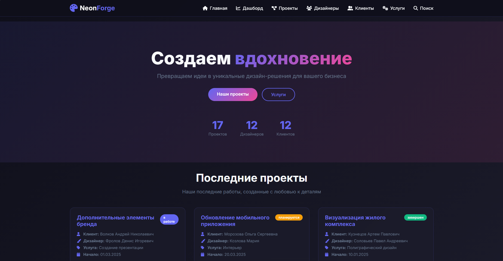
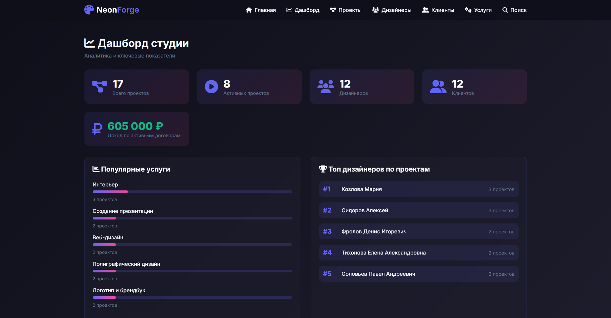
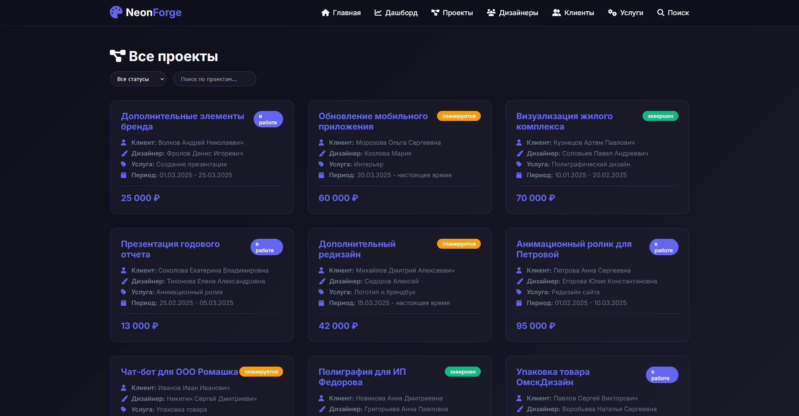

##  NeonForge

---

## О проекте

NeonForge - это учебный веб-проект дизайн-студии, выполненный в глубоких темных тонах с яркими неоновыми акцентами.

---

## Превью

<p align="center">
  
  
  
</p>

---

##  Технологии

* PHP
* MySQL
* HTML / CSS
* JavaScript

---

##  Запуск

### Способ 1 — Через XAMPP

1. Скачать проект (ZIP с GitHub)

2. Распаковать в папку:

   ```
   xampp/htdocs/neonforge
   ```

3. Запустить:

   * Apache
   * MySQL

4. Импортировать базу данных (sql/database.sql) через phpMyAdmin( http://localhost/phpmyadmin/index.php )

5. Открыть сайт:

   ```
   http://localhost/neonforge/index.php
   ```

---

### Способ 2 — Через Git
git clone https://github.com/soykoulen/NeonForgeRUS
cd neonforge

Далее:

1. Переместить проект в htdocs
2. Запустить Apache + MySQL
3. Импортировать базу данных
4. Настроить подключение
5. Открыть в браузере

---

##  Как это работает

База данных хранит:

* Проекты
* Имена, стажи и информацию про дизайнеров
* Услуги
* Информацию о клиентах

И связи между ними.

Сайт:

1. Получает данные
2. Обрабатывает связи
3. Создает страницы из данных
---

##Скоро будет перевод репозитория на английский язык, из-за экзаменов активничать не получается**

---
